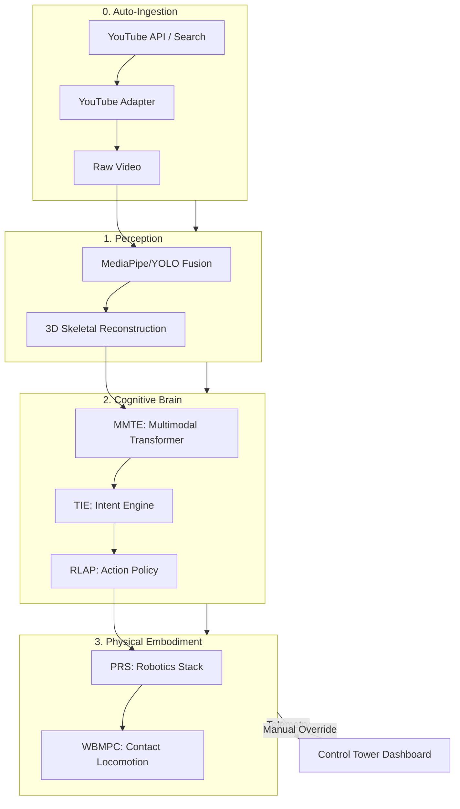

# Sign-Verse Robotics: The Sovereign Humanoid Intelligence Platform


Sign-Verse Robotics is a **frontier-grade, AI-native embodied intelligence system**. It bridges the gap between high-level human social intent and precise robotic manifestation. The platform is designed for mission-critical social interaction, dynamic locomotion, and human-in-the-loop safety.

## 🏗️ Core Architecture
The system operates on a continuous loop of high-frequency perception, cognitive understanding, and physical manifestation.



## 🚀 Key Milestones (V1.0 - V5.2)
The project evolved through **32 major implementation phases**, achieving state-of-the-art results in:
*   **MMTE (Multimodal Transformer Engine)**: Unified 345D tokenization of motion, face, and spatial context.
*   **TIE V2 (Intent Transformer)**: Sequence-aware intent classification.
*   **RL-SDS (Safety & Deployment)**: Uncertainty-aware exploration and proximity guardrails.
*   **WBMPC (Whole-Body MPC)**: High-performance C++ solver for contact-aware locomotion and footstep planning.
*   **Auto YouTube Pipeline (V5.2)**: Automated searching, downloading, and retargeting of motion data from YouTube categories (Workout, Dance, etc.) to build massive synthetic datasets.
*   **Control Tower Dashboard**: Next.js/Three.js cockpit for real-time 3D telemetry and batch job orchestration.

## 📂 System Structure
```text
src/
├── core/            # System Orchestration & Auto Pipelines
├── motion/          # Cognitive & Intent Pipelines
├── robotics/        # Kinematics, WBC, MPC, and WBMPC Solver
├── bridge/          # Dashboard APIs & Telemetry
└── perception/      # MediaPipe & YOLO Tracking
scripts/             # Batch Processing & Workflow Tools
dashboard/           # Next.js Command Center (Control Tower)
docs/                # Technical Reports & Handbooks
```

## 🛠️ Technology Stack
*   **Backend**: Python, FastAPI, WebSocket (30Hz), NumPy Vectorization.
*   **Control**: C++ (WBMPC Optimization Core), Numerical Jacobian IK.
*   **AI**: PyTorch, Transformers, Reinforcement Learning (PPO).
*   **Frontend**: Next.js, Three.js (WebGL), TailwindCSS, Zustand.

## 🛡️ Safety & Reliability
Sign-Verse is built for **Physical Sovereignty**. The system features a multi-layered safety stack:
1.  **Exploration Guardrails**: Managed ε-greedy exploration for stable online learning.
2.  **Stability Thresholds**: Automatic intent suppression if ZMP health drops below 80%.
3.  **Human Override**: Latching control system allowing operators to seize hardware control in <5ms.

---
**Developed by Sahil Khutey**
*Platform Status: Sovereign. Ready for World-Level Deployment.*
